# Quantified Self - README

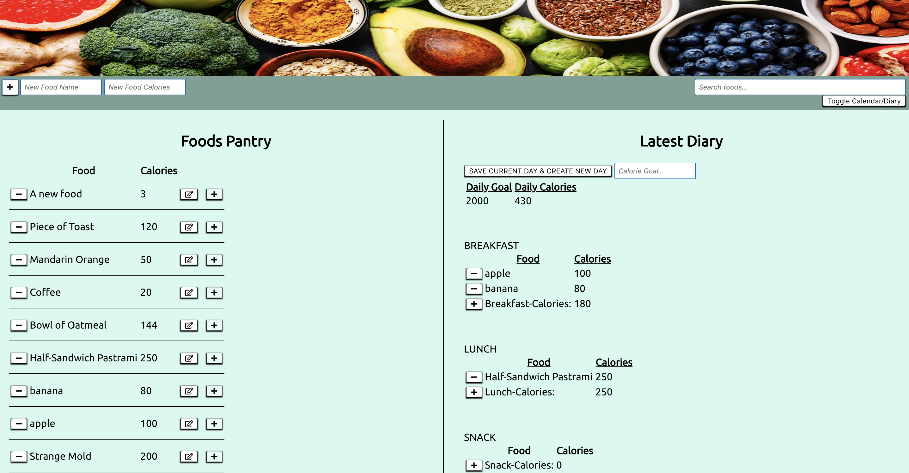

### Introduction:

Quantified Self is a calorie-tracking app that is designed to allow a user to log and view records of their caloric intake, by meal. Users can set daily caloric goals, create new food entries, and add food entries to meals, in order to track their dietary habits. Quantified self was built with Javascript, HTML, and Node.js, and is deployed at https://geoffreyadebonojo.github.io/quantified-self/. This project also used a project-board for organization, in development, which is located at https://github.com/geoffreyadebonojo/quantified-self/projects/1.

### Setup:

To begin, clone this repo:

```
https://danhutch.github.io/quantified-self/
```
After you `cd` into the project directory, run `npm install`, then `npm run build` from the command line.

At this point, you should be able to view the locally hosted app at http://localhost:8080/ after starting a local server using the command `npm start`.

### How to Use:

The user interface for Quantified Self was designed to be fairly intuitive and easy to understand.

##### Foods Pantry

The list of existing food entries appears on the left half of the page:
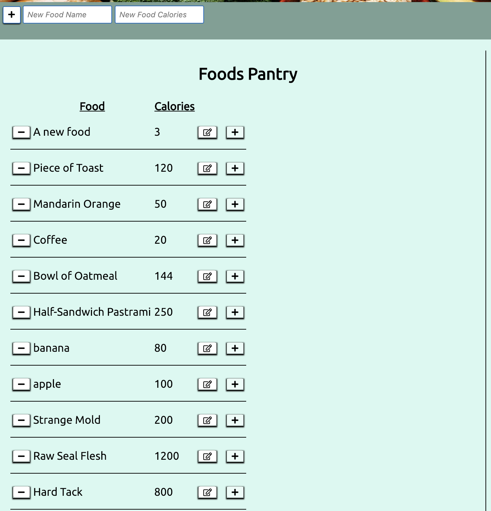

Users can create new foods by entering the name and caloric value into the appropriate fields and then clicking the "+" button next to those input fields:
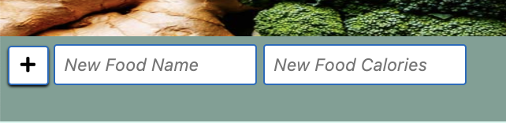

Any existing food can be edited by clicking the edit-icon button immediately to the right of that food's table row:
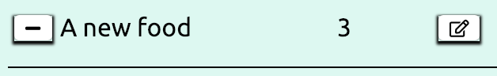

Doing so will cause two input fields to appear (one for food name, one for caloric value, both are pre-populated with the existing properties of that food) and edited/changed values may be entered in either or both:
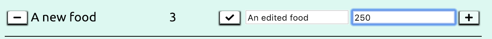

Changes can be submitted by clicking the checkmark button that has appeared in the place formerly occupied by the edit button. Any attempt to submit a modification wherein one field has been left blank will be unsuccessful.

Users can also search for foods, by name, using the search field at the upper right of the page:
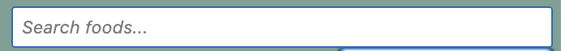

##### Daily Diary

The latest daily diary entry appears on the right half of the page:
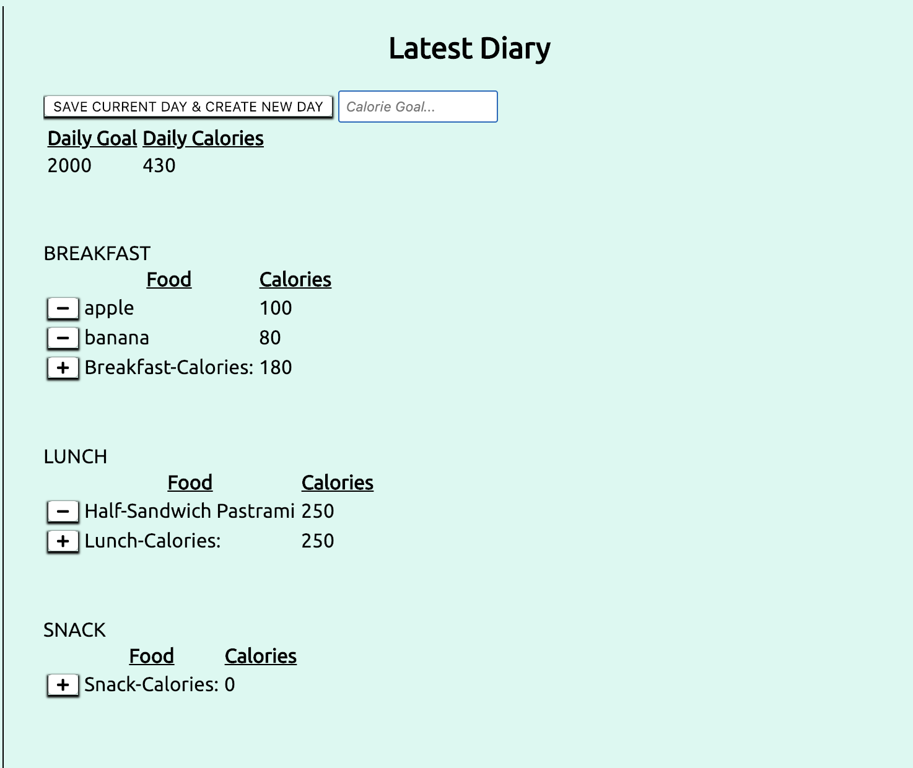

This portion of the page displays 4 meals for the latest daily-diary entry (Breakfast, Lunch, Snack, and Dinner), along with their caloric totals. A new food may be added to any meal by clicking the "+" button at the bottom left of that meal table:
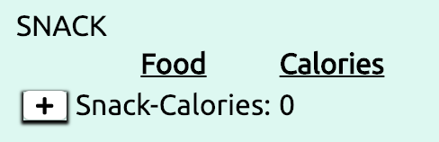


Doing so will activate the "+" buttons to the right of each food in the Foods Pantry:
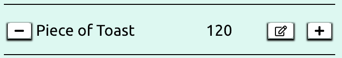


Clicking one of these will now add that food to the given meal and cause it to appear in that meal table:
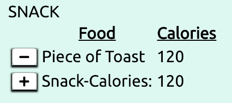

Foods may be removed from a meal by clicking the "-" button to the left of any food in a meal table.

At the top of the Daily Diary portion of the page, there is an input field and a button which allow the user to archive the currently-displayed day entry of the diary and create a new daily diary entry:
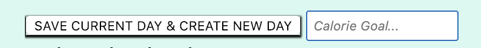

Creating a new daily-diary entry will create 4 new meals for that day, and attempts to do so without a calorie-goal entered for the new day will not execute successfully.

##### Calendar (Meal History)

Clicking the "Toggle Calendar/Diary" button in the upper right of the page will toggle the right hand portion of the page back and forth between "Daily Diary" and "Meal History" views:


The "Meal History" (calendar) view will display recorded meals in order of newest to oldest, along with their caloric totals, constituent foods, and the caloric values of those foods:
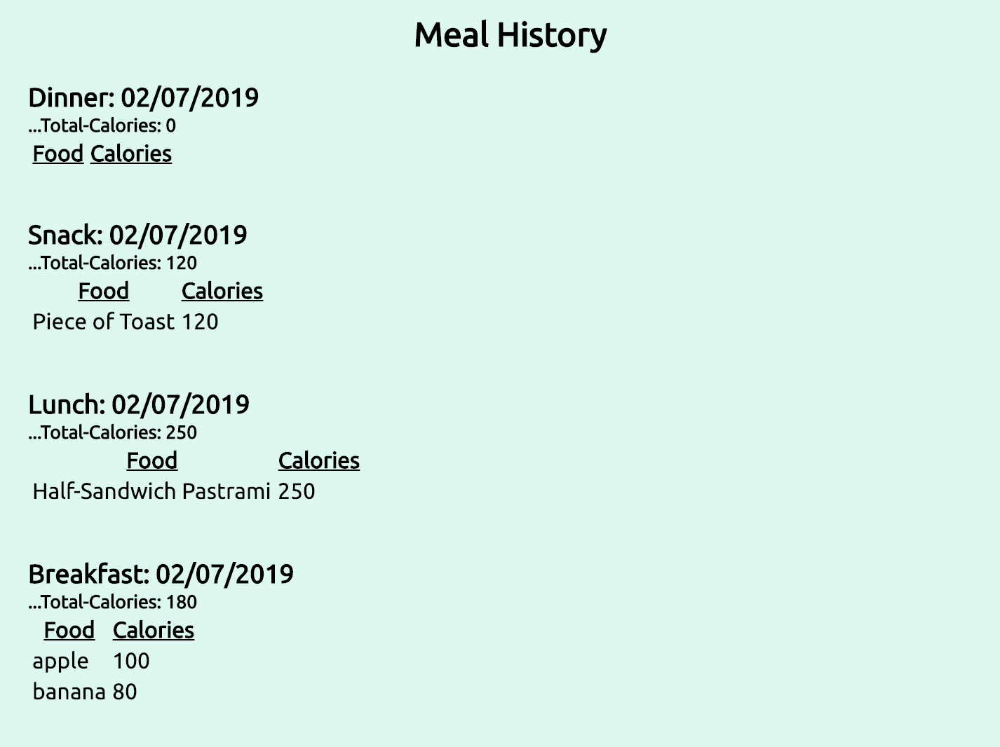

### Known Issues:

- Currently, the /meals endpoint (utilized to get data for both the diary and the calendar) does not return multiple instances of a single food if it has been added more than once to a given meal. This means users must create two examples of that food to have two of that food in a single meal.

- Historical (past) meal data does not include daily caloric goals.

- Changing the caloric value of an existing meal entry will change it's caloric value for any past meals with which it has already been associated.


### Back-End

 Quantified Self uses a back-end app, via API, that utilizes a Postgres database and was built with Express, Node.js, and Knex, and tested with Mocha and Chai. The back-end repo can be found at https://github.com/geoffreyadebonojo/quantified-self-be and is hosted on Heroku at https://warm-cove-64806.herokuapp.com/ (no page exists at this address, but this is the base URL for the API endpoints). Further documentation, including API endpoints, can be found at the above URL for the back-end repo.

### Future Iterations:

- Disable "new-day" button until valid input is present in the calorie-goal input field.

- Add more graphical visual elements to the UI.

- Implement user authentication using OmniAuth.


### Contributing:

In order to contribute, please fork this repo, then clone your new repo and create a branch for your feature.

Please make sure to test your feature thoroughly, then create and submit a pull request back to this repository.

Please contact Dan Hutchinson (DanHutch) or Geoffrey Adebonojo (geoffreyadebonojo) on Github if you have any questions, etc. Thank you!
